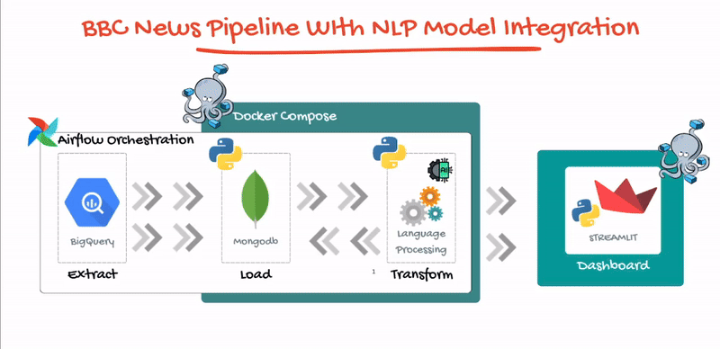
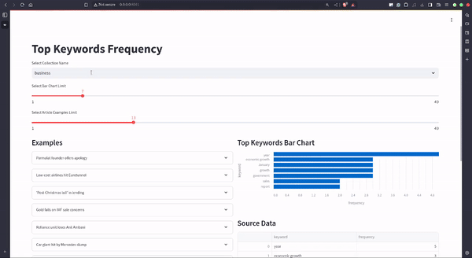
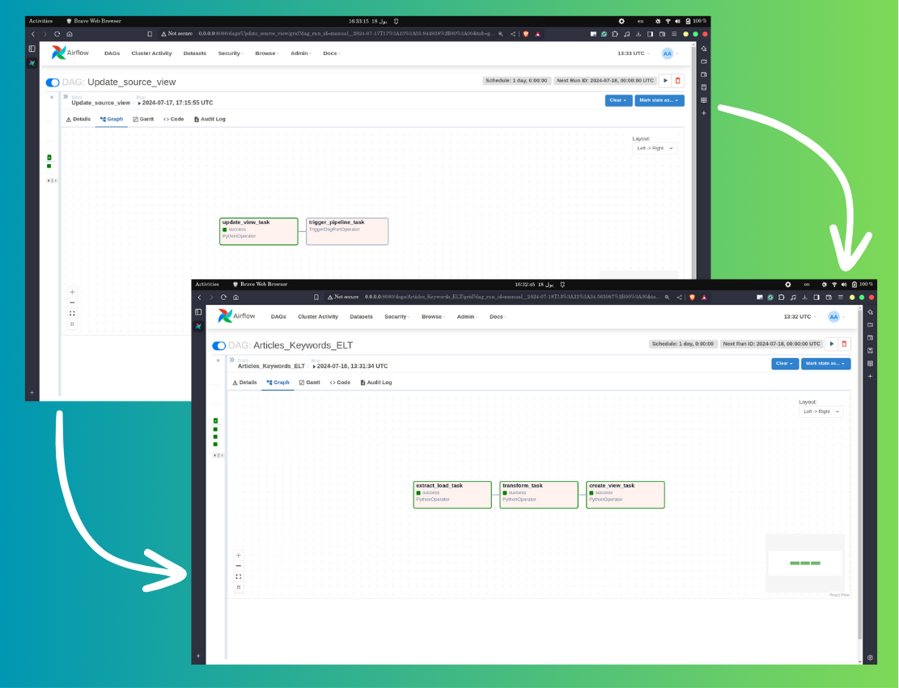

# BigQuery-NLP-Mongodb-ELT

## Introduction


Analyzing a collection of articles from BigQuery's open datasets `BBC_news` using the Yake keywords extractor, this project focuses on the following steps:
1. **Extracting data from BigQuery**
2. **Loading data into MongoDB**
3. **Enhancing documents by adding extracted keywords using language models technology**

This project applies `SOLID` principles and class injections to ensure scalability and maintainability. 
> ## Streamlit Dashboard
>**Check out the streamlit dashboard code at**: https://github.com/ahmadMuhammadGd/Mongodb-Streamlit-Report
> 
## Pipeline Components
|                      | **Tools/Technologies**              |
|------------------------------|----------------------------------|
| **Orchestration Tools**      | - Airflow                        |
| **Databases**                | - BigQuery (source), MongoDB (destination)             |
| **Neural Language Processing (NLP)** | - Yake                         |
| **Containerization**         | - Docker Compose                 |
| **Report**        | - Streamlit
## Airflow Dags
- Update_source_view
- Articles_Keywords_ELT

## Workflow
> `Update_source_view` triggers `Articles_Keywords_ELT` to run, ensuring coordination between teams.
>

## NoSQL Documents Examples
### Collections
An example from business collection. 
```json
{
  "_id": {
    "$oid": "66999923b427cd84f1c6854b"
  },
  "filename": "bbc/business/086.txt",
  "body": "UK manufacturing grew at its slowest pace in one-and-a-half years in January, according to a survey.\n\nThe Chartered Institute of Purchasing and Supply (CIPS) said its purchasing manager index (PMI) fell to 51.8 from a revised 53.3 in December. But, despite missing forecasts of 53.7, the PMI number remained above 50 - indicating expansion in the sector. The CIPS said that the strong pound had dented exports while rising oil and metals prices had kept costs high.\n\nThe survey added that rising input prices and cooling demand had deterred factory managers from hiring new workers in an effort to cut costs. That triggered the second successive monthly fall in the CIPS employment index to 48.3 - its lowest level since June 2003. The survey is more upbeat than official figures - which suggest that manufacturing is in recession - but analysts said the survey did suggest that the manufacturing recovery was running out of steam. \"It appears that the UK is in a two-tier economy again,\" said Prebon Yamane economist Lena Komileva. \"You have weakness in manufacturing, which I think would concern policymakers at the Bank of England.\"\n",
  "title": "Manufacturing recovery 'slowing'",
  "keywords": [
    {
      "kw": "slowest pace",
      "weight": 0.02520863662691541
    },
    {
      "kw": "Chartered Institute",
      "weight": 0.03837811335204958
    },
    {
      "kw": "January",
      "weight": 0.05866401249798595
    },
    {
      "kw": "CIPS",
      "weight": 0.07044058687133181
    },
    {
      "kw": "manufacturing grew",
      "weight": 0.0746641993937594
    },
    {
      "kw": "survey",
      "weight": 0.08878758334059766
    },
    {
      "kw": "purchasing manager",
      "weight": 0.0963642836491709
    },
    {
      "kw": "PMI",
      "weight": 0.09723556010112563
    },
    {
      "kw": "PMI number",
      "weight": 0.1040946673239318
    },
    {
      "kw": "Purchasing",
      "weight": 0.10882339854406728
    },
    {
      "kw": "manufacturing",
      "weight": 0.11076717738184556
    },
    {
      "kw": "years",
      "weight": 0.13941498844255026
    },
    {
      "kw": "CIPS employment",
      "weight": 0.14283774404582372
    },
    {
      "kw": "Lena Komileva",
      "weight": 0.15546651362990566
    },
    {
      "kw": "grew",
      "weight": 0.15680812107320088
    },
    {
      "kw": "slowest",
      "weight": 0.15680812107320088
    },
    {
      "kw": "pace",
      "weight": 0.15680812107320088
    },
    {
      "kw": "Prebon Yamane",
      "weight": 0.16670674941541747
    },
    {
      "kw": "Supply",
      "weight": 0.17792989556166205
    },
    {
      "kw": "December",
      "weight": 0.17792989556166205
    }
  ]
}
```
### Views
>Views were made for analytical porpuses
#### business_keywords_freq_view
```json
[
  {
    "_id": "firm",
    "avg_score": 0.12902223814959402,
    "freq": 2,
    "keyword": "firm"
  },
  {
    "_id": "production",
    "avg_score": 0.1779746569589588,
    "freq": 2,
    "keyword": "production"
  },
  .
  .
  .
]
```
### business_top_articles_view
```json
[
  {
    "_id": "669a6d683a0352fb4b8cbb13",
    "filename": "bbc/business/071.txt",
    "body": "Japanese brewers are increasingly making money from beer-flavoured drinks rather than beer itself\n\nBeer and spirits are heavily taxed in Japan, driving breweries to search for alternatives. Japan's long economic downturn helped drive the trend, as drinkers looked for cheaper opportunities to drown their sorrows. Now, according to Asahi Breweries, the market for so-called \"beer-like\" drinks is set to grow 84% this year.\n\nAsahi is predicting profits to rise 50% in 2005 as it launches a drink based on soybean peptides rather than malt. The chosen name, \"Shinnama\" or \"new draft\", disguises its non-beer nature. But despite a record profit in 2004 of 30.6bn yen ($291m; £154m), up 31.8% on the previous year, Asahi is coming late to the market. Key rival Sapporo is already well-established with the beer-flavoured \"Draft One\". Suntory, meanwhile, is doing well with \"Super Blue\", which combines happoshu - an existing low-cost beer alternative made with malt and seawater - and shochu, a distilled alcohol derived from sweet potatoes or barley. Happoshu has been a mainstay of brewery profits for years, taking over from beer thanks to its low tax and therefore low cost. Kirin, the fourth big name, is launching its own \"third-type\" drink in April.\n",
    "title": "Japan turns to beer alternatives",
    "averageScore": 0.1370148071643585
  },
]
```
## Project Structure
```plaintext
.
├── airflow.cfg
├── credentials
│   └── my-project-428316-bad106950325.json
├── dags
│   ├── BQ2MongoArticlesPipeline.py
│   ├── globalVaribles
│   │   ├── BQ2Mongo.py
│   │   └── CleanedArticleView.py
│   └── UpdateSourceCleanedView.py
├── docker-compose.yml
├── dockerfile
├── Notebooks
│   └── ArticlesSourceEDA.ipynb
├── pipeline_config
│   ├── articlesPipelineConfig.json
│   └── sourceCleanedViewConfig.json
├── README.md
├── requirements.txt
├── setup.sh
└── src
    ├── Config_parser.py
    ├── KeywordExtraction
    │   ├── base.py
    │   ├── KeywordExtractor.py
    │   └── Yake.py
    ├── NoSQLDist
    │   ├── base.py
    │   ├── Loader.py
    │   └── Mongodb_client.py
    └── TabularSource
        ├── base.py
        ├── BigQuery_client.py
        └── Extractor.py
```

## Exploring Source Data
Insights and results are documented in `./Notebooks/ArticlesSourceEDA.ipynb`.

## Setting Up The Project
To set up the project, run `./setup.sh` to launch Docker Compose.
